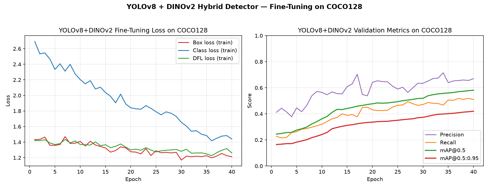

# YOLOv8 + DINOv2 Hybrid Object Detector (COCO128)

Implementation of the first work described at
https://cambum.net/I3DLab/AI4DM.htm — a YOLOv8 backbone fused with a
frozen DINOv2 foundation model's global embedding, injected at the
deepest backbone layer (SPPF output) to add semantic context on top of
YOLO's spatial features.

## Results

Fine-tuned from COCO-pretrained YOLOv8n weights for 40 epochs on
COCO128 (backbone frozen, only neck/head + new DINOv2 fusion layers
trained):

| Metric | Value |
|---|---|
| Precision | 0.671 |
| Recall | 0.510 |
| mAP@0.5 | 0.581 |
| mAP@0.5:0.95 | 0.420 |

Several classes (airplane, train, zebra, horse, bear, tv, hot dog,
skis) reach ~0.99 mAP@0.5. See `results/plots/training_metrics.png`
for the full training curve.



## Project layout

```
IUI-Assignment-1/
├── data/coco128.yaml                 # dataset config (auto-downloads COCO128)
├── models/
│   ├── dino_yolo.py                  # YOLOv8DINOv2 hybrid model definition
│   └── best_yolov8_dinov2.pt         # fine-tuned weights
├── train.py                          # fine-tuning entry point
├── inference.py                      # run on an image / folder / video
├── make_test_video.py                # builds a demo video from COCO128 frames
├── make_test_set.py                  # saves sample predicted images
├── plot_results.py                   # builds the labeled results figure
├── answers/                          # write-ups on the pretrained-weights question
├── results/
│   ├── yolov8_dinov2_coco128_final/  # full ultralytics run (weights, logs)
│   ├── plots/                        # curated plots incl. training_metrics.png
│   └── metrics/results.csv           # per-epoch metrics
└── test_outputs/
    ├── images/                       # sample predicted images
    ├── demo_input.mp4                # demo input video (from COCO128 frames)
    └── demo_input_pred.mp4           # predicted/annotated demo video
```

## Setup

```bash
cd IUI-Assignment-1
python3 -m venv .venv
source .venv/bin/activate
pip install -r requirements.txt
# CUDA-enabled torch (adjust cu121 to your driver's CUDA version if needed):
pip install torch torchvision --index-url https://download.pytorch.org/whl/cu121
```

Verify CUDA is visible:

```bash
python -c "import torch; print(torch.cuda.is_available(), torch.cuda.get_device_name(0) if torch.cuda.is_available() else 'CPU')"
```

## Train / fine-tune

```bash
source .venv/bin/activate
python train.py --epochs 40 --imgsz 640 --batch 16 --freeze 10
```

- First run auto-downloads COCO128.
- Backbone/neck/head start from COCO-pretrained `yolov8n.pt` (not random
  init) — see `answers/why_pretrained_weights.txt` for why this matters.
- The DINOv2 backbone (`dinov2_vits14`, via `torch.hub`) is frozen;
  only the DINOv2 projection conv, fusion conv, and (if `--freeze` is
  less than 10) the YOLO neck/head are trained.
- `--freeze N` freezes the first N backbone layers (default 10 = the
  whole yolov8n backbone) so fine-tuning only updates the neck/head +
  new fusion layers.
- `--continue_from path/to/last.pt` carries over weights from a
  previous run to keep improving without restarting from the
  COCO-pretrained baseline.
- Training curves, PR/F1 curves, confusion matrix, and `results.csv`
  land in `results/<run-name>/` and are copied into `results/plots/`
  and `results/metrics/`. Run `python plot_results.py` afterward to
  rebuild the clean, labeled summary figure.

## Build a test set / demo video and run inference

```bash
# sample predicted images into test_outputs/images/
python make_test_set.py --n 10

# build a short demo video out of COCO128 frames, then run detection on it
python make_test_video.py
python inference.py --source test_outputs/demo_input.mp4

# run on any image / video / folder
python inference.py --source path/to/image.jpg
python inference.py --source path/to/video.mp4
python inference.py --source path/to/folder/
```

Predicted output is written to `test_outputs/` (`*_pred.jpg` / `*_pred.mp4`).

## Architecture notes

`models/dino_yolo.py` defines `YOLOv8DINOv2(DetectionModel)`:

1. Builds a standard YOLOv8n backbone/neck/head.
2. Loads a frozen `dinov2_vits14` backbone and a learnable 1x1 conv
   that projects its `[CLS]` embedding to the channel width of the
   backbone's deepest layer (SPPF, layer index 9).
3. On the forward pass, after layer 9 produces its feature map, the
   DINOv2 embedding is broadcast spatially and concatenated with that
   feature map, then reduced back to the original channel width with
   a learnable fusion conv — injecting global scene context before the
   neck/head continue as normal.

This mirrors the hybrid strategy in the reference work: keep YOLO's
speed (DINOv2 is frozen and only adds one extra forward pass, no extra
backward cost) while injecting the semantic understanding DINOv2
provides to reduce false positives in cluttered scenes.
